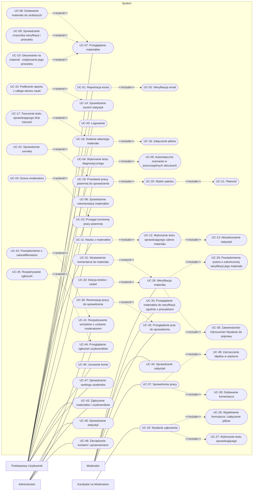

```mermaid
graph LR
    subgraph System
        UC01([UC-01: Rejestracja konta])
        UC02([UC-02: Weryfikacja email])
        UC03([UC-03: Logowanie])
        UC04([UC-04: Wykonanie testu diagnostycznego])
        UC05([UC-05: Automatyczne ocenianie w poszczególnych obszarach])
        UC06([UC-06: Sprawdzenie rekomendacji materiałów])
        UC07([UC-07: Przeglądanie materiałów])
        UC08([UC-08: Dodawanie materiału do ulubionych])
        UC09([UC-09: Sprawdzanie znacznika weryfikacji i priorytetu])
        UC10([UC-10: Głosowanie na materiał - zwiększanie jego priorytetu])
        UC11([UC-11: Nauka z materiałów])
        UC12([UC-12: Wykonanie testu sprawdzającego zakres materiału])
        UC13([UC-13: Aktualizowanie statystyk])
        UC14([UC-14: Sprawdzanie swoich statystyk])
        UC15([UC-15: Podbranie raportu z całego okresu nauki])
        UC16([UC-16: Dodanie własnego materiału])
        UC17([UC-17: Tworzenie testu sprawdzającego i/lub ćwiczeń])
        UC18([UC-18: Załączanie plików])
        UC19([UC-19: Przesłanie pracy pisemnej do sprawdzenia])
        UC20([UC-20: Wybór pakietu])
        UC21([UC-21: Płatność])
        UC22([UC-22: Sprawdzenie cennika])
        UC23([UC-23: Przegąd ocenionej pracy pisemnej])
        UC24([UC-24: Ocena moderatora])
        UC25([UC-25: Wysłanie zgłoszenia])
        UC26([UC-26: Wypełnienie formularza i załączenie plików])
        UC27([UC-27: Wykonanie testu sprawdzającego])
        UC28([UC-28: Weryfikacja materiału])
        UC29([UC-29: Powiadomienie autora o zakończonej weryfikacji jego materiału])
        UC30([UC-30: Zatwierdzenie/ Odrzucenie/ Wysłanie do poprawy])
        UC31([UC-31: Wystawienie komentarza do materiału])
        UC32([UC-32: Edycja testów i zadań])
        UC33([UC-33: Przeglądanie materiałów do weryfikacji zgodnie z priorytetami])
        UC34([UC-34: Sprawdzanie statystyk])
        UC35([UC-35: Przeglądanie prac do sprawdzenia])
        UC36([UC-36: Rezerwacja pracy do sprawdzenia])
        UC37([UC-37: Sprawdzenie pracy])
        UC38([UC-38: Zaznaczanie błędów w edytorze])
        UC39([UC-39: Dodawanie komentarza])
        UC40([UC-40: Sprawdzanie statystyk])
        UC41([UC-41: Rozpatrywanie wniosków o zostanie moderatorem])
        UC42([UC-42: Powiadomienie o zakwalifikowaniu])
        UC43([UC-43: Zgłaszanie materiałów i użytkowników])
        UC44([UC-44: Przeglądanie zgłoszeń użytkowników])
        UC45([UC-45: Rozpatrywanie zgłoszeń])
        UC46([UC-46: Usuwanie konta])
        UC47([UC-47: Sprawdzanie rankingu studentów])
        UC48([UC-48: Zarządzanie kontami i uprawnieniami])
    end

    %% Aktorzy
    Student[Podstawowy Użytkownik]
    Moderator[Moderator]
    Admin[Administrator]
    Candidate[Kandydat na Moderatora]

    %% Relacje Student
    Student --- UC01
    Student --- UC03
    Student --- UC04
    Student --- UC06
    Student --- UC07
    Student --- UC11
    Student --- UC14
    Student --- UC16
    Student --- UC19
    Student --- UC23
    Student --- UC43
    Student --- UC46
    Student --- UC47

    %% Relacje Kandydat
    Candidate --- UC25

    %% Relacje Moderator
    Moderator --- UC28
    Moderator --- UC33
    Moderator --- UC34
    Moderator --- UC35
    Moderator --- UC37

    %% Relacje Administrator
    Admin --- UC40
    Admin --- UC41
    Admin --- UC43
    Admin --- UC44
    Admin --- UC48

    %% Zależności
    UC01 -. "#60;#60;include#62;#62;" .-> UC02
    UC04 -. "#60;#60;include#62;#62;" .-> UC05
    UC08 -. "#60;#60;extend#62;#62;" .-> UC07
    UC09 -. "#60;#60;extend#62;#62;" .-> UC07
    UC10 -. "#60;#60;extend#62;#62;" .-> UC07
    UC11 -. "#60;#60;include#62;#62;" .-> UC12
    UC12 -. "#60;#60;include#62;#62;" .-> UC13
    UC15 -. "#60;#60;extend#62;#62;" .-> UC14
    UC16 -. "#60;#60;include#62;#62;" .-> UC18
    UC17 -. "#60;#60;extend#62;#62;" .-> UC16
    UC19 -. "#60;#60;include#62;#62;" .-> UC20
    UC20 -. "#60;#60;include#62;#62;" .-> UC21
    UC22 -. "#60;#60;extend#62;#62;" .-> UC19
    UC24 -. "#60;#60;extend#62;#62;" .-> UC23
    UC25 -. "#60;#60;include#62;#62;" .-> UC26
    UC25 -. "#60;#60;include#62;#62;" .-> UC27
    UC28 -. "#60;#60;include#62;#62;" .-> UC29
    UC28 -. "#60;#60;include#62;#62;" .-> UC30
    UC31 -. "#60;#60;extend#62;#62;" .-> UC28
    UC32 -. "#60;#60;extend#62;#62;" .-> UC28
    UC36 -. "#60;#60;extend#62;#62;" .-> UC35
    UC37 -. "#60;#60;include#62;#62;" .-> UC38
    UC37 -. "#60;#60;include#62;#62;" .-> UC39
    UC42 -. "#60;#60;extend#62;#62;" .-> UC41
    UC45 -. "#60;#60;extend#62;#62;" .-> UC44
```
