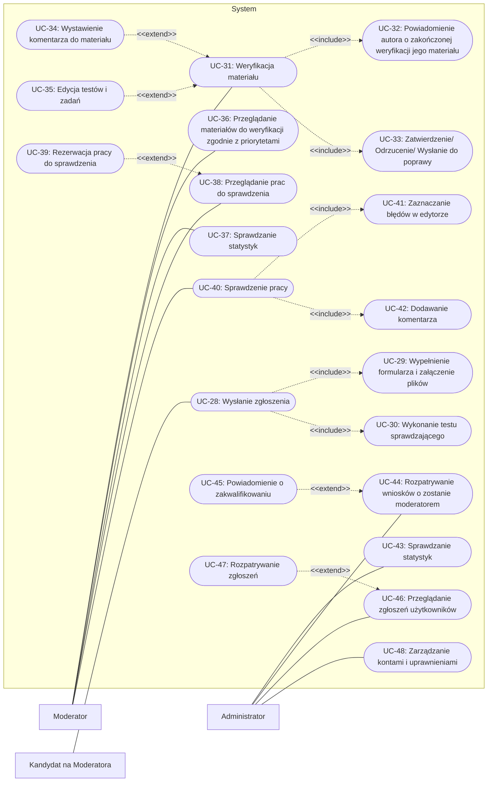

```mermaid
graph LR
    subgraph System
        UC28([UC-28: Wysłanie zgłoszenia])
        
        UC29([UC-29: Wypełnienie formularza i załączenie plików])
        UC30([UC-30: Wykonanie testu sprawdzającego])
        UC31([UC-31: Weryfikacja materiału])
        UC32([UC-32: Powiadomienie autora o zakończonej weryfikacji jego materiału])
        UC33([UC-33: Zatwierdzenie/ Odrzucenie/ Wysłanie do poprawy])
        UC34([UC-34: Wystawienie komentarza do materiału])
        UC35([UC-35: Edycja testów i zadań])
        UC36([UC-36: Przeglądanie materiałów do weryfikacji zgodnie z priorytetami])
        UC37([UC-37: Sprawdzanie statystyk])
        UC38([UC-38: Przeglądanie prac do sprawdzenia])
        UC39([UC-39: Rezerwacja pracy do sprawdzenia])
        UC40([UC-40: Sprawdzenie pracy])
        UC41([UC-41: Zaznaczanie błędów w edytorze])
        UC42([UC-42: Dodawanie komentarza])
        
        UC43([UC-43: Sprawdzanie statystyk])
        UC44([UC-44: Rozpatrywanie wniosków o zostanie moderatorem])
        UC45([UC-45: Powiadomienie o zakwalifikowaniu])
        UC46([UC-46: Przeglądanie zgłoszeń użytkowników])
        UC47([UC-47: Rozpatrywanie zgłoszeń])
        UC48([UC-48: Zarządzanie kontami i uprawnieniami])
    end

    %% Aktorzy
    Moderator[Moderator]
    Admin[Administrator]
    Candidate[Kandydat na Moderatora]
    
    %% Relacje Kandydat
    Candidate --- UC28

    %% Relacje Moderator
    Moderator --- UC31
    Moderator --- UC36
    Moderator --- UC37
    Moderator --- UC38
    Moderator --- UC40

    %% Relacje Administrator
    Admin --- UC43
    Admin --- UC44
    Admin --- UC46
    Admin --- UC48

    %% Zależności
    UC28 -. "#60;#60;include#62;#62;" .-> UC29
    UC28 -. "#60;#60;include#62;#62;" .-> UC30
    UC31 -. "#60;#60;include#62;#62;" .-> UC32
    UC31 -. "#60;#60;include#62;#62;" .-> UC33
    UC34 -. "#60;#60;extend#62;#62;" .-> UC31
    UC35 -. "#60;#60;extend#62;#62;" .-> UC31
    UC39 -. "#60;#60;extend#62;#62;" .-> UC38
    UC40 -. "#60;#60;include#62;#62;" .-> UC41
    UC40 -. "#60;#60;include#62;#62;" .-> UC42
    UC45 -. "#60;#60;extend#62;#62;" .-> UC44
    UC47 -. "#60;#60;extend#62;#62;" .-> UC46
```
