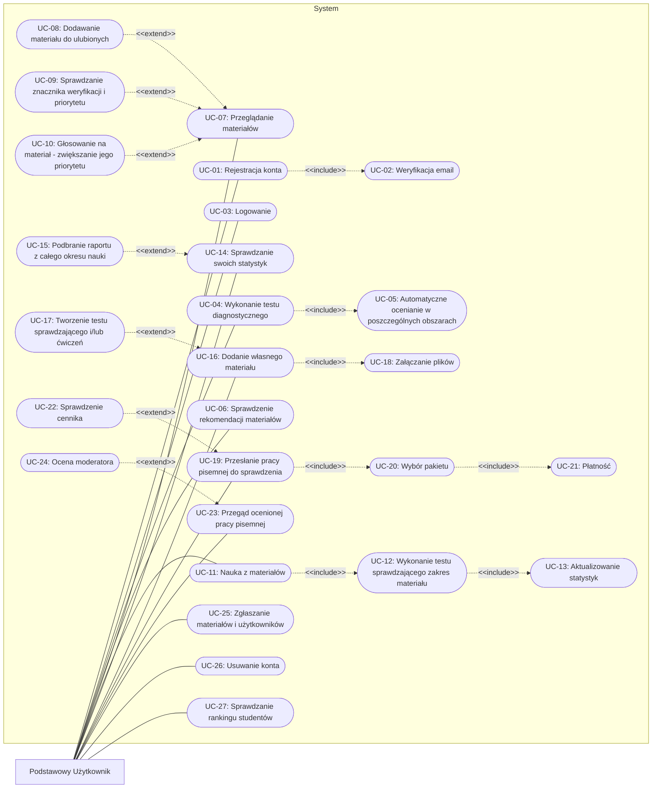

```mermaid
graph LR
    subgraph System
        UC01([UC-01: Rejestracja konta])
        UC02([UC-02: Weryfikacja email])
        UC03([UC-03: Logowanie])
        UC04([UC-04: Wykonanie testu diagnostycznego])
        UC05([UC-05: Automatyczne ocenianie w poszczególnych obszarach])
        UC06([UC-06: Sprawdzenie rekomendacji materiałów])
        UC07([UC-07: Przeglądanie materiałów])
        UC08([UC-08: Dodawanie materiału do ulubionych])
        UC09([UC-09: Sprawdzanie znacznika weryfikacji i priorytetu])
        UC10([UC-10: Głosowanie na materiał - zwiększanie jego priorytetu])
        UC11([UC-11: Nauka z materiałów])
        UC12([UC-12: Wykonanie testu sprawdzającego zakres materiału])
        UC13([UC-13: Aktualizowanie statystyk])
        UC14([UC-14: Sprawdzanie swoich statystyk])
        UC15([UC-15: Podbranie raportu z całego okresu nauki])
        UC16([UC-16: Dodanie własnego materiału])
        UC17([UC-17: Tworzenie testu sprawdzającego i/lub ćwiczeń])
        UC18([UC-18: Załączanie plików])
        UC19([UC-19: Przesłanie pracy pisemnej do sprawdzenia])
        UC20([UC-20: Wybór pakietu])
        UC21([UC-21: Płatność])
        UC22([UC-22: Sprawdzenie cennika])
        UC23([UC-23: Przegąd ocenionej pracy pisemnej])
        UC24([UC-24: Ocena moderatora])
        UC25([UC-25: Zgłaszanie materiałów i użytkowników])
        UC26([UC-26: Usuwanie konta])
        UC27([UC-27: Sprawdzanie rankingu studentów])
    end

    %% Aktorzy
    Student[Podstawowy Użytkownik]

    %% Relacje Student
    Student --- UC01
    Student --- UC03
    Student --- UC04
    Student --- UC06
    Student --- UC07
    Student --- UC11
    Student --- UC14
    Student --- UC16
    Student --- UC19
    Student --- UC23
    Student --- UC25
    Student --- UC26
    Student --- UC27
    %% Zależności
    UC01 -. "#60;#60;include#62;#62;" .-> UC02
    UC04 -. "#60;#60;include#62;#62;" .-> UC05
    UC08 -. "#60;#60;extend#62;#62;" .-> UC07
    UC09 -. "#60;#60;extend#62;#62;" .-> UC07
    UC10 -. "#60;#60;extend#62;#62;" .-> UC07
    UC11 -. "#60;#60;include#62;#62;" .-> UC12
    UC12 -. "#60;#60;include#62;#62;" .-> UC13
    UC15 -. "#60;#60;extend#62;#62;" .-> UC14
    UC16 -. "#60;#60;include#62;#62;" .-> UC18
    UC17 -. "#60;#60;extend#62;#62;" .-> UC16
    UC19 -. "#60;#60;include#62;#62;" .-> UC20
    UC20 -. "#60;#60;include#62;#62;" .-> UC21
    UC22 -. "#60;#60;extend#62;#62;" .-> UC19
    UC24 -. "#60;#60;extend#62;#62;" .-> UC23
```
