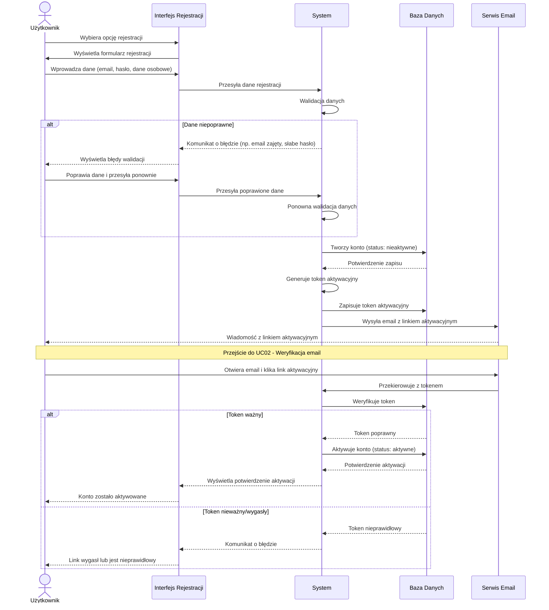

```mermaid
sequenceDiagram
    actor U as Użytkownik
    participant UI as Interfejs Rejestracji
    participant S as System
    participant DB as Baza Danych
    participant E as Serwis Email

    U->>UI: Wybiera opcję rejestracji
    UI->>U: Wyświetla formularz rejestracji
    U->>UI: Wprowadza dane (email, hasło, dane osobowe)
    UI->>S: Przesyła dane rejestracji
    S->>S: Walidacja danych

    alt Dane niepoprawne
        S-->>UI: Komunikat o błędzie (np. email zajęty, słabe hasło)
        UI-->>U: Wyświetla błędy walidacji
        U->>UI: Poprawia dane i przesyła ponownie
        UI->>S: Przesyła poprawione dane
        S->>S: Ponowna walidacja danych
    end

    S->>DB: Tworzy konto (status: nieaktywne)
    DB-->>S: Potwierdzenie zapisu
    S->>S: Generuje token aktywacyjny
    S->>DB: Zapisuje token aktywacyjny
    S->>E: Wysyła email z linkiem aktywacyjnym
    E-->>U: Wiadomość z linkiem aktywacyjnym

    Note over U, E: Przejście do UC02 - Weryfikacja email

    U->>E: Otwiera email i klika link aktywacyjny
    E->>S: Przekierowuje z tokenem
    S->>DB: Weryfikuje token
    alt Token ważny
        DB-->>S: Token poprawny
        S->>DB: Aktywuje konto (status: aktywne)
        DB-->>S: Potwierdzenie aktywacji
        S-->>UI: Wyświetla potwierdzenie aktywacji
        UI-->>U: Konto zostało aktywowane
    else Token nieważny/wygasły
        DB-->>S: Token nieprawidłowy
        S-->>UI: Komunikat o błędzie
        UI-->>U: Link wygasł lub jest nieprawidłowy
    end
```
