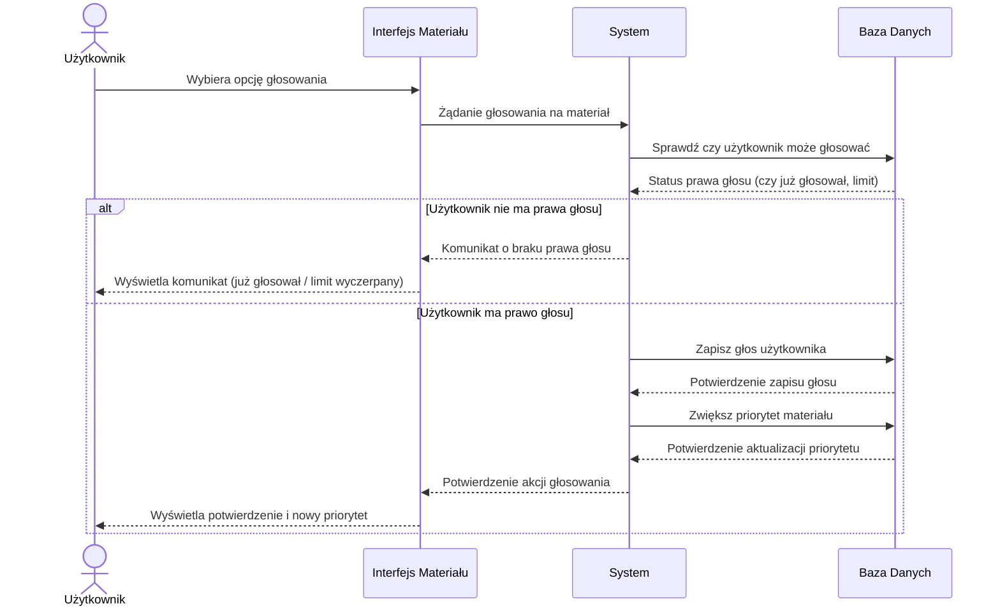

```mermaid
sequenceDiagram
    actor U as Użytkownik
    participant UI as Interfejs Materiału
    participant S as System
    participant DB as Baza Danych

    U->>UI: Wybiera opcję głosowania
    UI->>S: Żądanie głosowania na materiał
    S->>DB: Sprawdź czy użytkownik może głosować
    DB-->>S: Status prawa głosu (czy już głosował, limit)

    alt Użytkownik nie ma prawa głosu
        S-->>UI: Komunikat o braku prawa głosu
        UI-->>U: Wyświetla komunikat (już głosował / limit wyczerpany)
    else Użytkownik ma prawo głosu
        S->>DB: Zapisz głos użytkownika
        DB-->>S: Potwierdzenie zapisu głosu
        S->>DB: Zwiększ priorytet materiału
        DB-->>S: Potwierdzenie aktualizacji priorytetu
        S-->>UI: Potwierdzenie akcji głosowania
        UI-->>U: Wyświetla potwierdzenie i nowy priorytet
    end
```
