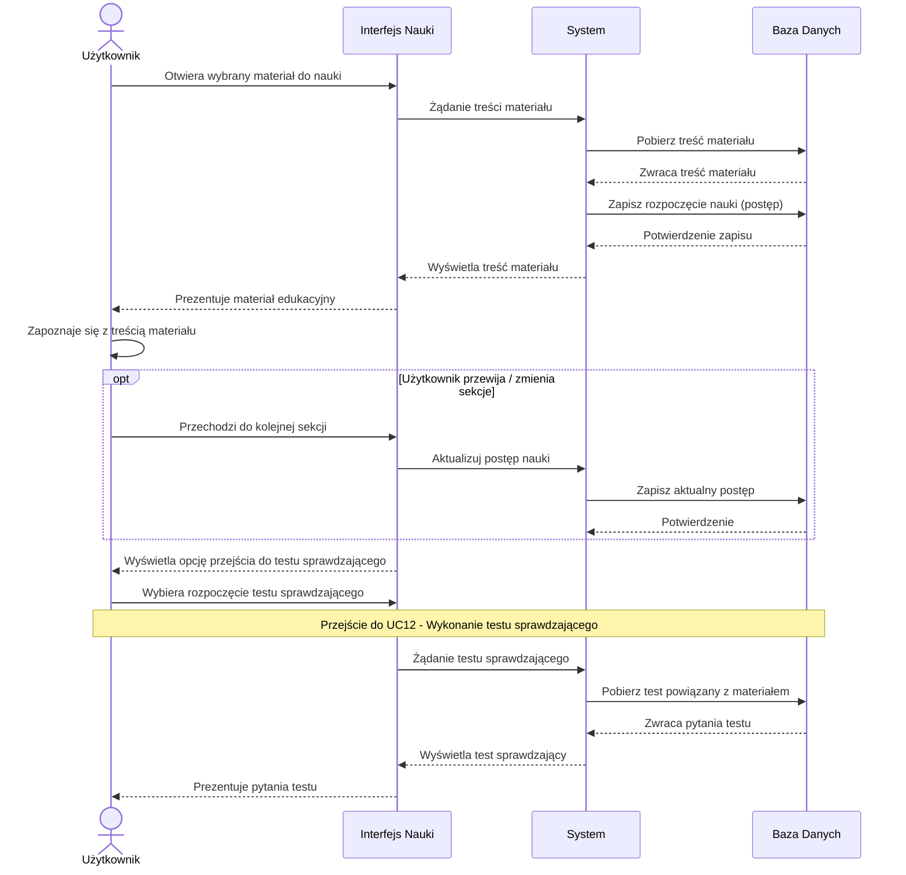

```mermaid
sequenceDiagram
    actor U as Użytkownik
    participant UI as Interfejs Nauki
    participant S as System
    participant DB as Baza Danych

    U->>UI: Otwiera wybrany materiał do nauki
    UI->>S: Żądanie treści materiału
    S->>DB: Pobierz treść materiału
    DB-->>S: Zwraca treść materiału
    S->>DB: Zapisz rozpoczęcie nauki (postęp)
    DB-->>S: Potwierdzenie zapisu
    S-->>UI: Wyświetla treść materiału
    UI-->>U: Prezentuje materiał edukacyjny

    U->>U: Zapoznaje się z treścią materiału

    opt Użytkownik przewija / zmienia sekcje
        U->>UI: Przechodzi do kolejnej sekcji
        UI->>S: Aktualizuj postęp nauki
        S->>DB: Zapisz aktualny postęp
        DB-->>S: Potwierdzenie
    end

    UI-->>U: Wyświetla opcję przejścia do testu sprawdzającego
    U->>UI: Wybiera rozpoczęcie testu sprawdzającego

    Note over U, DB: Przejście do UC12 - Wykonanie testu sprawdzającego

    UI->>S: Żądanie testu sprawdzającego
    S->>DB: Pobierz test powiązany z materiałem
    DB-->>S: Zwraca pytania testu
    S-->>UI: Wyświetla test sprawdzający
    UI-->>U: Prezentuje pytania testu
```
