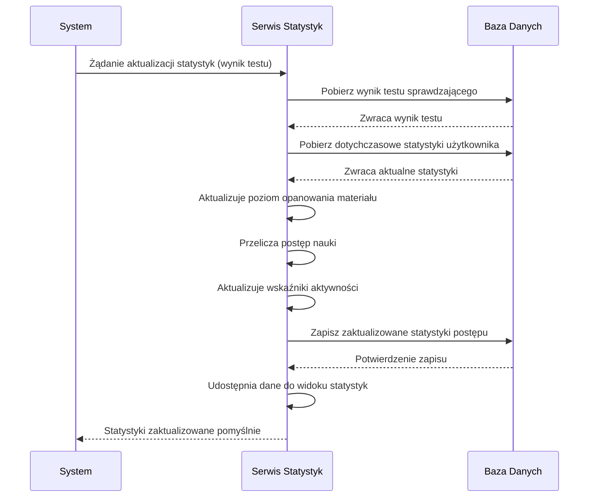

```mermaid
sequenceDiagram
    participant S as System
    participant SS as Serwis Statystyk
    participant DB as Baza Danych

    S->>SS: Żądanie aktualizacji statystyk (wynik testu)
    SS->>DB: Pobierz wynik testu sprawdzającego
    DB-->>SS: Zwraca wynik testu

    SS->>DB: Pobierz dotychczasowe statystyki użytkownika
    DB-->>SS: Zwraca aktualne statystyki

    SS->>SS: Aktualizuje poziom opanowania materiału
    SS->>SS: Przelicza postęp nauki
    SS->>SS: Aktualizuje wskaźniki aktywności

    SS->>DB: Zapisz zaktualizowane statystyki postępu
    DB-->>SS: Potwierdzenie zapisu

    SS->>SS: Udostępnia dane do widoku statystyk
    SS-->>S: Statystyki zaktualizowane pomyślnie
```
