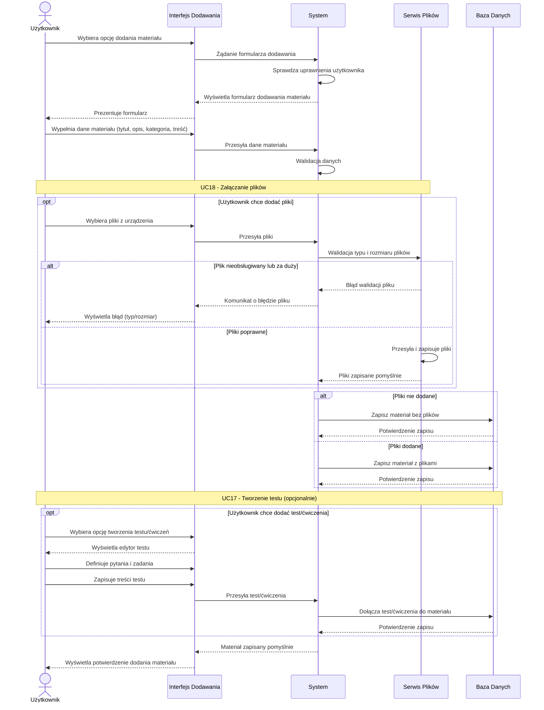

```mermaid
sequenceDiagram
    actor U as Użytkownik
    participant UI as Interfejs Dodawania
    participant S as System
    participant FS as Serwis Plików
    participant DB as Baza Danych

    U->>UI: Wybiera opcję dodania materiału
    UI->>S: Żądanie formularza dodawania
    S->>S: Sprawdza uprawnienia użytkownika
    S-->>UI: Wyświetla formularz dodawania materiału
    UI-->>U: Prezentuje formularz

    U->>UI: Wypełnia dane materiału (tytuł, opis, kategoria, treść)
    UI->>S: Przesyła dane materiału
    S->>S: Walidacja danych

    Note over U, FS: UC18 - Załączanie plików

    opt Użytkownik chce dodać pliki
        U->>UI: Wybiera pliki z urządzenia
        UI->>S: Przesyła pliki
        S->>FS: Walidacja typu i rozmiaru plików

        alt Plik nieobsługiwany lub za duży
            FS-->>S: Błąd walidacji pliku
            S-->>UI: Komunikat o błędzie pliku
            UI-->>U: Wyświetla błąd (typ/rozmiar)
        else Pliki poprawne
            FS->>FS: Przesyła i zapisuje pliki
            FS-->>S: Pliki zapisane pomyślnie
        end
    end

    alt Pliki nie dodane
        S->>DB: Zapisz materiał bez plików
        DB-->>S: Potwierdzenie zapisu
    else Pliki dodane
        S->>DB: Zapisz materiał z plikami
        DB-->>S: Potwierdzenie zapisu
    end

    Note over U, DB: UC17 - Tworzenie testu (opcjonalnie)

    opt Użytkownik chce dodać test/ćwiczenia
        U->>UI: Wybiera opcję tworzenia testu/ćwiczeń
        UI-->>U: Wyświetla edytor testu
        U->>UI: Definiuje pytania i zadania
        U->>UI: Zapisuje treści testu
        UI->>S: Przesyła test/ćwiczenia
        S->>DB: Dołącza test/ćwiczenia do materiału
        DB-->>S: Potwierdzenie zapisu
    end

    S-->>UI: Materiał zapisany pomyślnie
    UI-->>U: Wyświetla potwierdzenie dodania materiału
```
