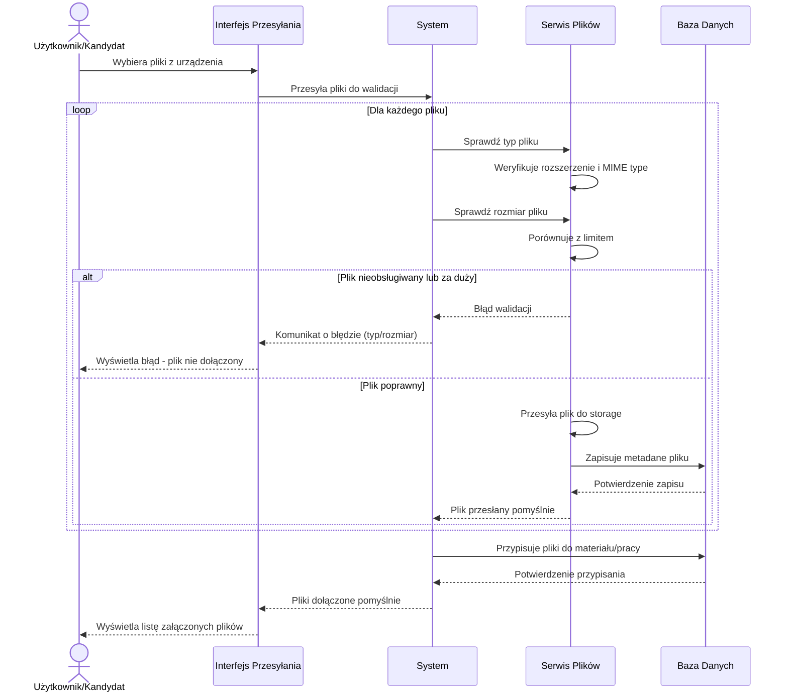

```mermaid
sequenceDiagram
    actor U as Użytkownik/Kandydat
    participant UI as Interfejs Przesyłania
    participant S as System
    participant FS as Serwis Plików
    participant DB as Baza Danych

    U->>UI: Wybiera pliki z urządzenia
    UI->>S: Przesyła pliki do walidacji

    loop Dla każdego pliku
        S->>FS: Sprawdź typ pliku
        FS->>FS: Weryfikuje rozszerzenie i MIME type
        S->>FS: Sprawdź rozmiar pliku
        FS->>FS: Porównuje z limitem

        alt Plik nieobsługiwany lub za duży
            FS-->>S: Błąd walidacji
            S-->>UI: Komunikat o błędzie (typ/rozmiar)
            UI-->>U: Wyświetla błąd - plik nie dołączony
        else Plik poprawny
            FS->>FS: Przesyła plik do storage
            FS->>DB: Zapisuje metadane pliku
            DB-->>FS: Potwierdzenie zapisu
            FS-->>S: Plik przesłany pomyślnie
        end
    end

    S->>DB: Przypisuje pliki do materiału/pracy
    DB-->>S: Potwierdzenie przypisania
    S-->>UI: Pliki dołączone pomyślnie
    UI-->>U: Wyświetla listę załączonych plików
```
