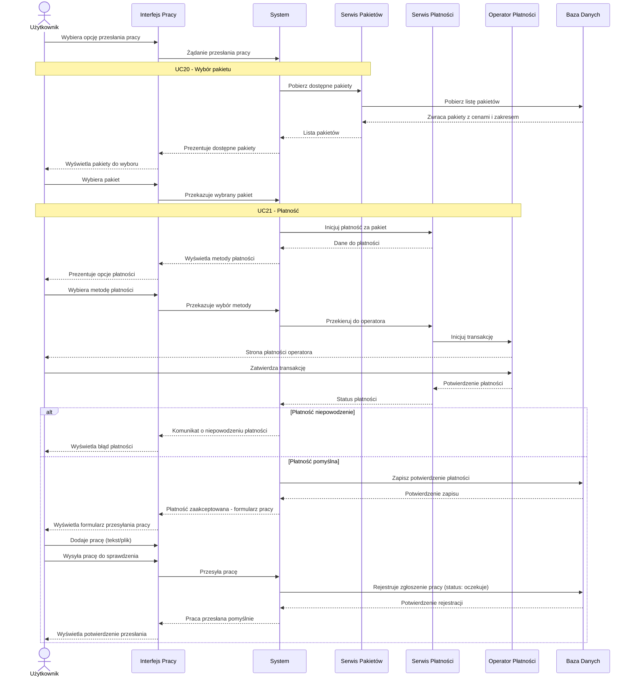

```mermaid
sequenceDiagram
    actor U as Użytkownik
    participant UI as Interfejs Pracy
    participant S as System
    participant PS as Serwis Pakietów
    participant PL as Serwis Płatności
    participant OP as Operator Płatności
    participant DB as Baza Danych

    U->>UI: Wybiera opcję przesłania pracy
    UI->>S: Żądanie przesłania pracy

    Note over U, PS: UC20 - Wybór pakietu

    S->>PS: Pobierz dostępne pakiety
    PS->>DB: Pobierz listę pakietów
    DB-->>PS: Zwraca pakiety z cenami i zakresem
    PS-->>S: Lista pakietów
    S-->>UI: Prezentuje dostępne pakiety
    UI-->>U: Wyświetla pakiety do wyboru

    U->>UI: Wybiera pakiet
    UI->>S: Przekazuje wybrany pakiet

    Note over U, OP: UC21 - Płatność

    S->>PL: Inicjuj płatność za pakiet
    PL-->>S: Dane do płatności
    S-->>UI: Wyświetla metody płatności
    UI-->>U: Prezentuje opcje płatności
    U->>UI: Wybiera metodę płatności
    UI->>S: Przekazuje wybór metody
    S->>PL: Przekieruj do operatora
    PL->>OP: Inicjuj transakcję
    OP-->>U: Strona płatności operatora
    U->>OP: Zatwierdza transakcję
    OP-->>PL: Potwierdzenie płatności
    PL-->>S: Status płatności

    alt Płatność niepowodzenie
        S-->>UI: Komunikat o niepowodzeniu płatności
        UI-->>U: Wyświetla błąd płatności
    else Płatność pomyślna
        S->>DB: Zapisz potwierdzenie płatności
        DB-->>S: Potwierdzenie zapisu
        S-->>UI: Płatność zaakceptowana - formularz pracy
        UI-->>U: Wyświetla formularz przesyłania pracy

        U->>UI: Dodaje pracę (tekst/plik)
        U->>UI: Wysyła pracę do sprawdzenia
        UI->>S: Przesyła pracę
        S->>DB: Rejestruje zgłoszenie pracy (status: oczekuje)
        DB-->>S: Potwierdzenie rejestracji
        S-->>UI: Praca przesłana pomyślnie
        UI-->>U: Wyświetla potwierdzenie przesłania
    end
```
