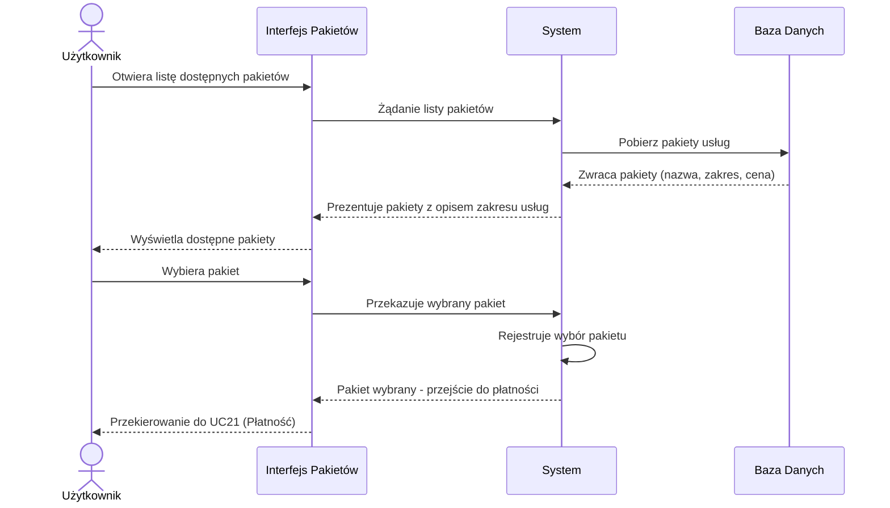

```mermaid
sequenceDiagram
    actor U as Użytkownik
    participant UI as Interfejs Pakietów
    participant S as System
    participant DB as Baza Danych

    U->>UI: Otwiera listę dostępnych pakietów
    UI->>S: Żądanie listy pakietów
    S->>DB: Pobierz pakiety usług
    DB-->>S: Zwraca pakiety (nazwa, zakres, cena)
    S-->>UI: Prezentuje pakiety z opisem zakresu usług
    UI-->>U: Wyświetla dostępne pakiety

    U->>UI: Wybiera pakiet
    UI->>S: Przekazuje wybrany pakiet
    S->>S: Rejestruje wybór pakietu
    S-->>UI: Pakiet wybrany - przejście do płatności
    UI-->>U: Przekierowanie do UC21 (Płatność)
```
