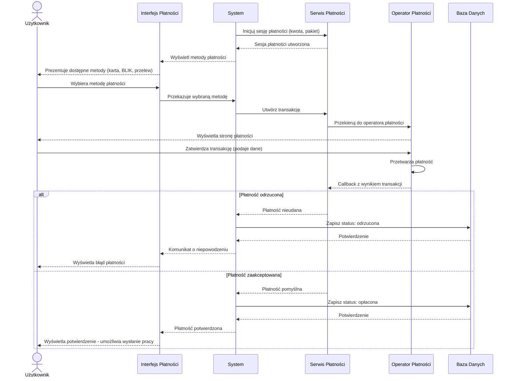

```mermaid
sequenceDiagram
    actor U as Użytkownik
    participant UI as Interfejs Płatności
    participant S as System
    participant PL as Serwis Płatności
    participant OP as Operator Płatności
    participant DB as Baza Danych

    S->>PL: Inicjuj sesję płatności (kwota, pakiet)
    PL-->>S: Sesja płatności utworzona
    S-->>UI: Wyświetl metody płatności
    UI-->>U: Prezentuje dostępne metody (karta, BLIK, przelew)

    U->>UI: Wybiera metodę płatności
    UI->>S: Przekazuje wybraną metodę
    S->>PL: Utwórz transakcję
    PL->>OP: Przekieruj do operatora płatności
    OP-->>U: Wyświetla stronę płatności

    U->>OP: Zatwierdza transakcję (podaje dane)
    OP->>OP: Przetwarza płatność
    OP-->>PL: Callback z wynikiem transakcji

    alt Płatność odrzucona
        PL-->>S: Płatność nieudana
        S->>DB: Zapisz status: odrzucona
        DB-->>S: Potwierdzenie
        S-->>UI: Komunikat o niepowodzeniu
        UI-->>U: Wyświetla błąd płatności
    else Płatność zaakceptowana
        PL-->>S: Płatność pomyślna
        S->>DB: Zapisz status: opłacona
        DB-->>S: Potwierdzenie
        S-->>UI: Płatność potwierdzona
        UI-->>U: Wyświetla potwierdzenie - umożliwia wysłanie pracy
    end
```
