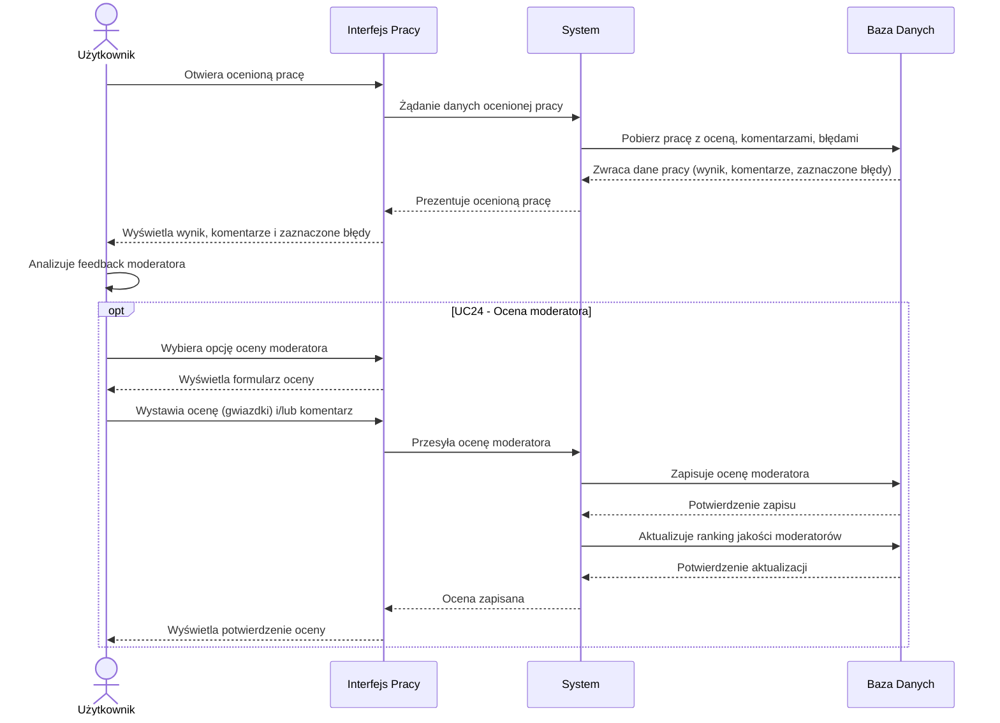

```mermaid
sequenceDiagram
    actor U as Użytkownik
    participant UI as Interfejs Pracy
    participant S as System
    participant DB as Baza Danych

    U->>UI: Otwiera ocenioną pracę
    UI->>S: Żądanie danych ocenionej pracy
    S->>DB: Pobierz pracę z oceną, komentarzami, błędami
    DB-->>S: Zwraca dane pracy (wynik, komentarze, zaznaczone błędy)
    S-->>UI: Prezentuje ocenioną pracę
    UI-->>U: Wyświetla wynik, komentarze i zaznaczone błędy

    U->>U: Analizuje feedback moderatora

    opt UC24 - Ocena moderatora
        U->>UI: Wybiera opcję oceny moderatora
        UI-->>U: Wyświetla formularz oceny
        U->>UI: Wystawia ocenę (gwiazdki) i/lub komentarz
        UI->>S: Przesyła ocenę moderatora
        S->>DB: Zapisuje ocenę moderatora
        DB-->>S: Potwierdzenie zapisu
        S->>DB: Aktualizuje ranking jakości moderatorów
        DB-->>S: Potwierdzenie aktualizacji
        S-->>UI: Ocena zapisana
        UI-->>U: Wyświetla potwierdzenie oceny
    end
```
