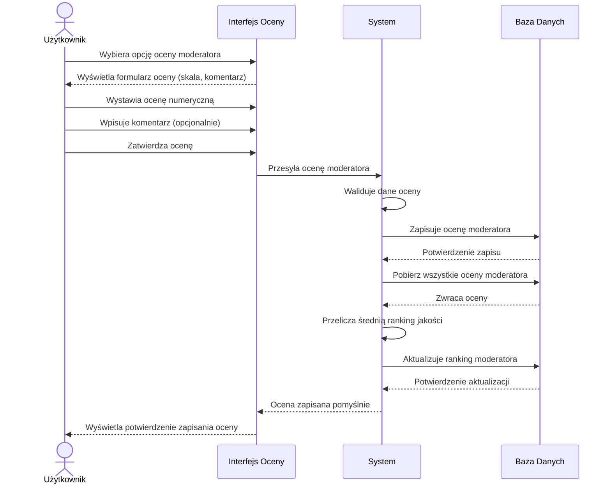

```mermaid
sequenceDiagram
    actor U as Użytkownik
    participant UI as Interfejs Oceny
    participant S as System
    participant DB as Baza Danych

    U->>UI: Wybiera opcję oceny moderatora
    UI-->>U: Wyświetla formularz oceny (skala, komentarz)
    U->>UI: Wystawia ocenę numeryczną
    U->>UI: Wpisuje komentarz (opcjonalnie)
    U->>UI: Zatwierdza ocenę
    UI->>S: Przesyła ocenę moderatora

    S->>S: Waliduje dane oceny
    S->>DB: Zapisuje ocenę moderatora
    DB-->>S: Potwierdzenie zapisu
    S->>DB: Pobierz wszystkie oceny moderatora
    DB-->>S: Zwraca oceny
    S->>S: Przelicza średnią ranking jakości
    S->>DB: Aktualizuje ranking moderatora
    DB-->>S: Potwierdzenie aktualizacji

    S-->>UI: Ocena zapisana pomyślnie
    UI-->>U: Wyświetla potwierdzenie zapisania oceny
```
