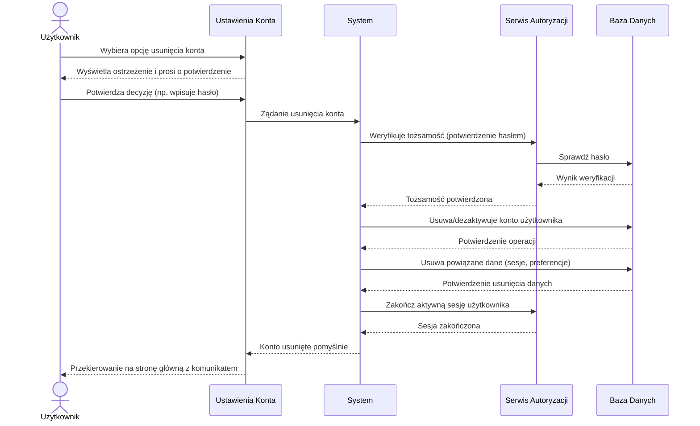

```mermaid
sequenceDiagram
    actor U as Użytkownik
    participant UI as Ustawienia Konta
    participant S as System
    participant Auth as Serwis Autoryzacji
    participant DB as Baza Danych

    U->>UI: Wybiera opcję usunięcia konta
    UI-->>U: Wyświetla ostrzeżenie i prosi o potwierdzenie

    U->>UI: Potwierdza decyzję (np. wpisuje hasło)
    UI->>S: Żądanie usunięcia konta

    S->>Auth: Weryfikuje tożsamość (potwierdzenie hasłem)
    Auth->>DB: Sprawdź hasło
    DB-->>Auth: Wynik weryfikacji
    Auth-->>S: Tożsamość potwierdzona

    S->>DB: Usuwa/dezaktywuje konto użytkownika
    DB-->>S: Potwierdzenie operacji
    S->>DB: Usuwa powiązane dane (sesje, preferencje)
    DB-->>S: Potwierdzenie usunięcia danych

    S->>Auth: Zakończ aktywną sesję użytkownika
    Auth-->>S: Sesja zakończona

    S-->>UI: Konto usunięte pomyślnie
    UI-->>U: Przekierowanie na stronę główną z komunikatem
```
