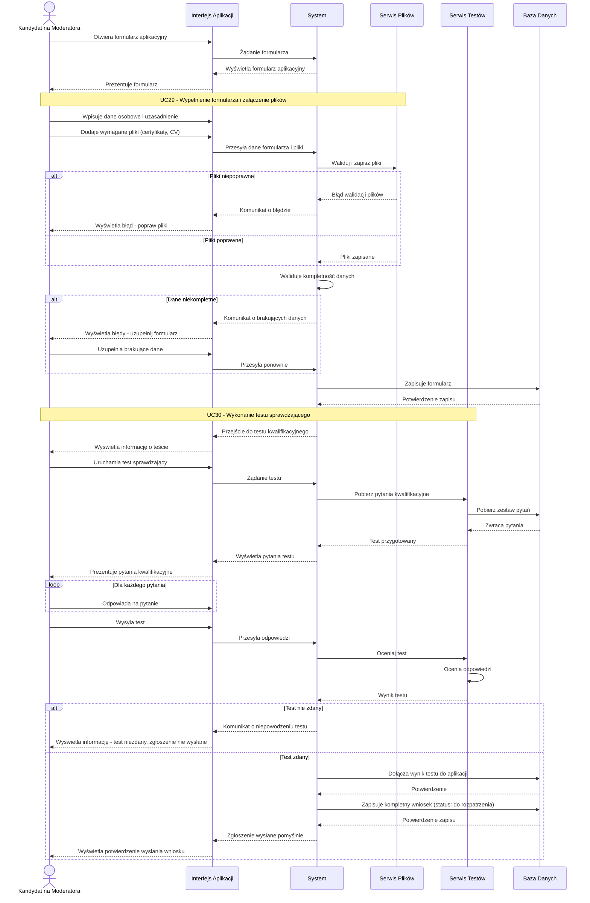

```mermaid
sequenceDiagram
    actor K as Kandydat na Moderatora
    participant UI as Interfejs Aplikacji
    participant S as System
    participant FS as Serwis Plików
    participant TS as Serwis Testów
    participant DB as Baza Danych

    K->>UI: Otwiera formularz aplikacyjny
    UI->>S: Żądanie formularza
    S-->>UI: Wyświetla formularz aplikacyjny
    UI-->>K: Prezentuje formularz

    Note over K, FS: UC29 - Wypełnienie formularza i załączenie plików

    K->>UI: Wpisuje dane osobowe i uzasadnienie
    K->>UI: Dodaje wymagane pliki (certyfikaty, CV)
    UI->>S: Przesyła dane formularza i pliki

    S->>FS: Waliduj i zapisz pliki
    alt Pliki niepoprawne
        FS-->>S: Błąd walidacji plików
        S-->>UI: Komunikat o błędzie
        UI-->>K: Wyświetla błąd - popraw pliki
    else Pliki poprawne
        FS-->>S: Pliki zapisane
    end

    S->>S: Waliduje kompletność danych
    alt Dane niekompletne
        S-->>UI: Komunikat o brakujących danych
        UI-->>K: Wyświetla błędy - uzupełnij formularz
        K->>UI: Uzupełnia brakujące dane
        UI->>S: Przesyła ponownie
    end

    S->>DB: Zapisuje formularz
    DB-->>S: Potwierdzenie zapisu

    Note over K, TS: UC30 - Wykonanie testu sprawdzającego

    S-->>UI: Przejście do testu kwalifikacyjnego
    UI-->>K: Wyświetla informację o teście
    K->>UI: Uruchamia test sprawdzający
    UI->>S: Żądanie testu
    S->>TS: Pobierz pytania kwalifikacyjne
    TS->>DB: Pobierz zestaw pytań
    DB-->>TS: Zwraca pytania
    TS-->>S: Test przygotowany
    S-->>UI: Wyświetla pytania testu
    UI-->>K: Prezentuje pytania kwalifikacyjne

    loop Dla każdego pytania
        K->>UI: Odpowiada na pytanie
    end

    K->>UI: Wysyła test
    UI->>S: Przesyła odpowiedzi
    S->>TS: Oceniaj test
    TS->>TS: Ocenia odpowiedzi
    TS-->>S: Wynik testu

    alt Test nie zdany
        S-->>UI: Komunikat o niepowodzeniu testu
        UI-->>K: Wyświetla informację - test niezdany, zgłoszenie nie wysłane
    else Test zdany
        S->>DB: Dołącza wynik testu do aplikacji
        DB-->>S: Potwierdzenie
        S->>DB: Zapisuje kompletny wniosek (status: do rozpatrzenia)
        DB-->>S: Potwierdzenie zapisu
        S-->>UI: Zgłoszenie wysłane pomyślnie
        UI-->>K: Wyświetla potwierdzenie wysłania wniosku
    end
```
