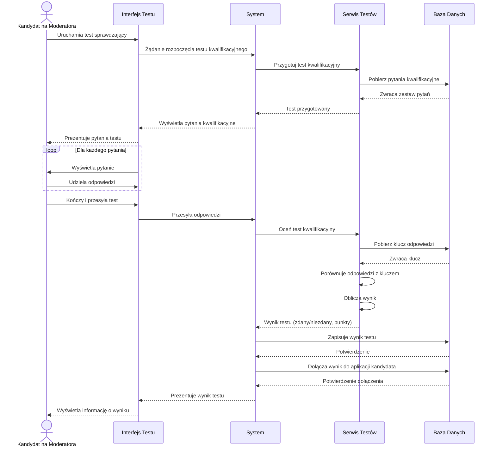

```mermaid
sequenceDiagram
    actor K as Kandydat na Moderatora
    participant UI as Interfejs Testu
    participant S as System
    participant TS as Serwis Testów
    participant DB as Baza Danych

    K->>UI: Uruchamia test sprawdzający
    UI->>S: Żądanie rozpoczęcia testu kwalifikacyjnego
    S->>TS: Przygotuj test kwalifikacyjny
    TS->>DB: Pobierz pytania kwalifikacyjne
    DB-->>TS: Zwraca zestaw pytań
    TS-->>S: Test przygotowany
    S-->>UI: Wyświetla pytania kwalifikacyjne
    UI-->>K: Prezentuje pytania testu

    loop Dla każdego pytania
        UI->>K: Wyświetla pytanie
        K->>UI: Udziela odpowiedzi
    end

    K->>UI: Kończy i przesyła test
    UI->>S: Przesyła odpowiedzi
    S->>TS: Oceń test kwalifikacyjny
    TS->>DB: Pobierz klucz odpowiedzi
    DB-->>TS: Zwraca klucz
    TS->>TS: Porównuje odpowiedzi z kluczem
    TS->>TS: Oblicza wynik
    TS-->>S: Wynik testu (zdany/niezdany, punkty)

    S->>DB: Zapisuje wynik testu
    DB-->>S: Potwierdzenie
    S->>DB: Dołącza wynik do aplikacji kandydata
    DB-->>S: Potwierdzenie dołączenia

    S-->>UI: Prezentuje wynik testu
    UI-->>K: Wyświetla informację o wyniku
```
