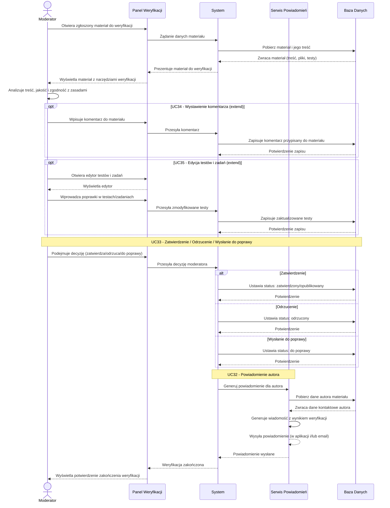

```mermaid
sequenceDiagram
    actor M as Moderator
    participant UI as Panel Weryfikacji
    participant S as System
    participant NS as Serwis Powiadomień
    participant DB as Baza Danych

    M->>UI: Otwiera zgłoszony materiał do weryfikacji
    UI->>S: Żądanie danych materiału
    S->>DB: Pobierz materiał i jego treść
    DB-->>S: Zwraca materiał (treść, pliki, testy)
    S-->>UI: Prezentuje materiał do weryfikacji
    UI-->>M: Wyświetla materiał z narzędziami weryfikacji

    M->>M: Analizuje treść, jakość i zgodność z zasadami

    opt UC34 - Wystawienie komentarza (extend)
        M->>UI: Wpisuje komentarz do materiału
        UI->>S: Przesyła komentarz
        S->>DB: Zapisuje komentarz przypisany do materiału
        DB-->>S: Potwierdzenie zapisu
    end

    opt UC35 - Edycja testów i zadań (extend)
        M->>UI: Otwiera edytor testów i zadań
        UI-->>M: Wyświetla edytor
        M->>UI: Wprowadza poprawki w testach/zadaniach
        UI->>S: Przesyła zmodyfikowane testy
        S->>DB: Zapisuje zaktualizowane testy
        DB-->>S: Potwierdzenie zapisu
    end

    Note over M, DB: UC33 - Zatwierdzenie / Odrzucenie / Wysłanie do poprawy

    M->>UI: Podejmuje decyzję (zatwierdza/odrzuca/do poprawy)
    UI->>S: Przesyła decyzję moderatora

    alt Zatwierdzenie
        S->>DB: Ustawia status: zatwierdzony/opublikowany
        DB-->>S: Potwierdzenie
    else Odrzucenie
        S->>DB: Ustawia status: odrzucony
        DB-->>S: Potwierdzenie
    else Wysłanie do poprawy
        S->>DB: Ustawia status: do poprawy
        DB-->>S: Potwierdzenie
    end

    Note over S, NS: UC32 - Powiadomienie autora

    S->>NS: Generuj powiadomienie dla autora
    NS->>DB: Pobierz dane autora materiału
    DB-->>NS: Zwraca dane kontaktowe autora
    NS->>NS: Generuje wiadomość z wynikiem weryfikacji
    NS-->>NS: Wysyła powiadomienie (w aplikacji i/lub email)
    NS-->>S: Powiadomienie wysłane

    S-->>UI: Weryfikacja zakończona
    UI-->>M: Wyświetla potwierdzenie zakończenia weryfikacji
```
