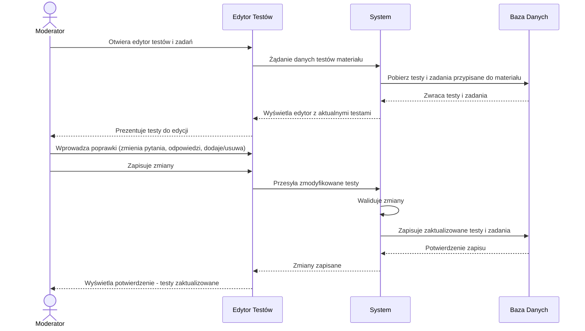

```mermaid
sequenceDiagram
    actor M as Moderator
    participant UI as Edytor Testów
    participant S as System
    participant DB as Baza Danych

    M->>UI: Otwiera edytor testów i zadań
    UI->>S: Żądanie danych testów materiału
    S->>DB: Pobierz testy i zadania przypisane do materiału
    DB-->>S: Zwraca testy i zadania
    S-->>UI: Wyświetla edytor z aktualnymi testami
    UI-->>M: Prezentuje testy do edycji

    M->>UI: Wprowadza poprawki (zmienia pytania, odpowiedzi, dodaje/usuwa)
    M->>UI: Zapisuje zmiany
    UI->>S: Przesyła zmodyfikowane testy
    S->>S: Waliduje zmiany
    S->>DB: Zapisuje zaktualizowane testy i zadania
    DB-->>S: Potwierdzenie zapisu
    S-->>UI: Zmiany zapisane
    UI-->>M: Wyświetla potwierdzenie - testy zaktualizowane
```
