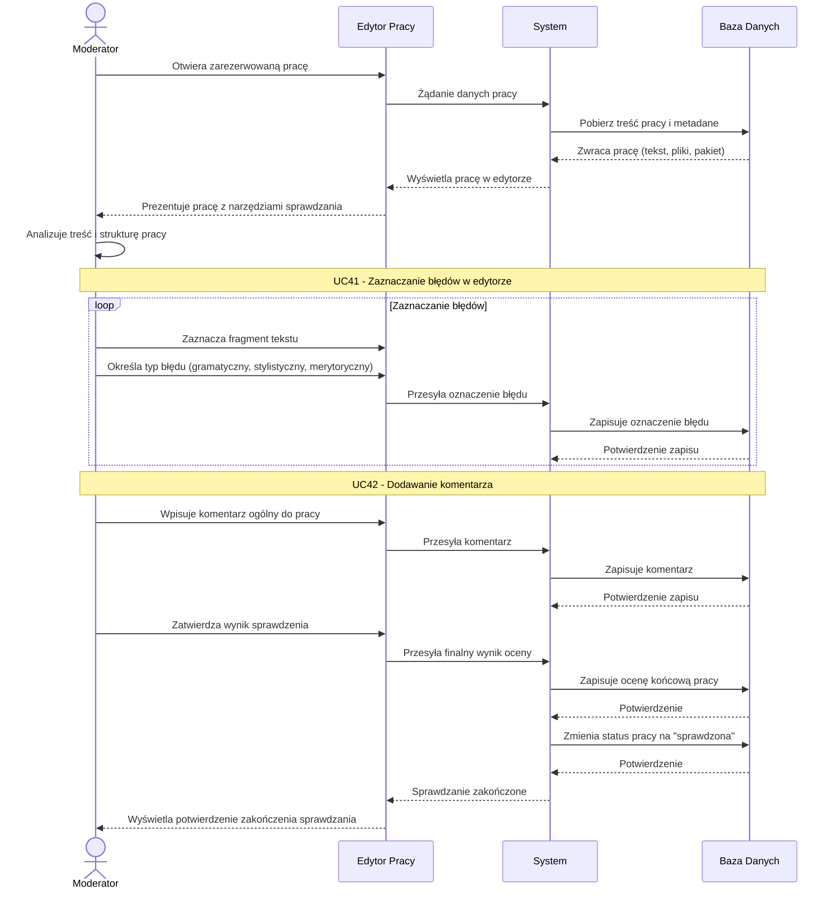

```mermaid
sequenceDiagram
    actor M as Moderator
    participant UI as Edytor Pracy
    participant S as System
    participant DB as Baza Danych

    M->>UI: Otwiera zarezerwowaną pracę
    UI->>S: Żądanie danych pracy
    S->>DB: Pobierz treść pracy i metadane
    DB-->>S: Zwraca pracę (tekst, pliki, pakiet)
    S-->>UI: Wyświetla pracę w edytorze
    UI-->>M: Prezentuje pracę z narzędziami sprawdzania

    M->>M: Analizuje treść i strukturę pracy

    Note over M, DB: UC41 - Zaznaczanie błędów w edytorze

    loop Zaznaczanie błędów
        M->>UI: Zaznacza fragment tekstu
        M->>UI: Określa typ błędu (gramatyczny, stylistyczny, merytoryczny)
        UI->>S: Przesyła oznaczenie błędu
        S->>DB: Zapisuje oznaczenie błędu
        DB-->>S: Potwierdzenie zapisu
    end

    Note over M, DB: UC42 - Dodawanie komentarza

    M->>UI: Wpisuje komentarz ogólny do pracy
    UI->>S: Przesyła komentarz
    S->>DB: Zapisuje komentarz
    DB-->>S: Potwierdzenie zapisu

    M->>UI: Zatwierdza wynik sprawdzenia
    UI->>S: Przesyła finalny wynik oceny
    S->>DB: Zapisuje ocenę końcową pracy
    DB-->>S: Potwierdzenie
    S->>DB: Zmienia status pracy na "sprawdzona"
    DB-->>S: Potwierdzenie
    S-->>UI: Sprawdzanie zakończone
    UI-->>M: Wyświetla potwierdzenie zakończenia sprawdzania
```
