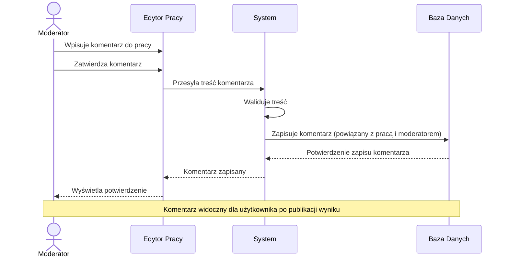

```mermaid
sequenceDiagram
    actor M as Moderator
    participant UI as Edytor Pracy
    participant S as System
    participant DB as Baza Danych

    M->>UI: Wpisuje komentarz do pracy
    M->>UI: Zatwierdza komentarz
    UI->>S: Przesyła treść komentarza
    S->>S: Waliduje treść
    S->>DB: Zapisuje komentarz (powiązany z pracą i moderatorem)
    DB-->>S: Potwierdzenie zapisu komentarza
    S-->>UI: Komentarz zapisany
    UI-->>M: Wyświetla potwierdzenie

    Note over M, DB: Komentarz widoczny dla użytkownika po publikacji wyniku
```
