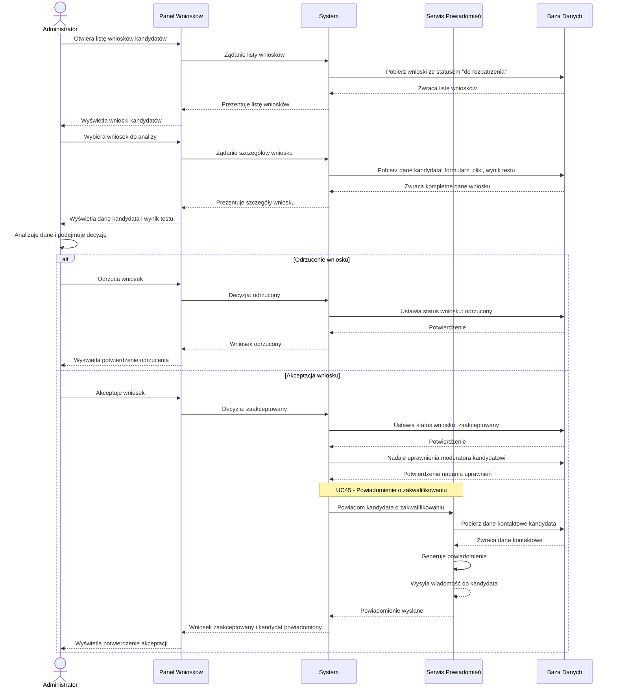

```mermaid
sequenceDiagram
    actor A as Administrator
    participant UI as Panel Wniosków
    participant S as System
    participant NS as Serwis Powiadomień
    participant DB as Baza Danych

    A->>UI: Otwiera listę wniosków kandydatów
    UI->>S: Żądanie listy wniosków
    S->>DB: Pobierz wnioski ze statusem "do rozpatrzenia"
    DB-->>S: Zwraca listę wniosków
    S-->>UI: Prezentuje listę wniosków
    UI-->>A: Wyświetla wnioski kandydatów

    A->>UI: Wybiera wniosek do analizy
    UI->>S: Żądanie szczegółów wniosku
    S->>DB: Pobierz dane kandydata, formularz, pliki, wynik testu
    DB-->>S: Zwraca kompletne dane wniosku
    S-->>UI: Prezentuje szczegóły wniosku
    UI-->>A: Wyświetla dane kandydata i wynik testu

    A->>A: Analizuje dane i podejmuje decyzję

    alt Odrzucenie wniosku
        A->>UI: Odrzuca wniosek
        UI->>S: Decyzja: odrzucony
        S->>DB: Ustawia status wniosku: odrzucony
        DB-->>S: Potwierdzenie
        S-->>UI: Wniosek odrzucony
        UI-->>A: Wyświetla potwierdzenie odrzucenia
    else Akceptacja wniosku
        A->>UI: Akceptuje wniosek
        UI->>S: Decyzja: zaakceptowany
        S->>DB: Ustawia status wniosku: zaakceptowany
        DB-->>S: Potwierdzenie
        S->>DB: Nadaje uprawnienia moderatora kandydatowi
        DB-->>S: Potwierdzenie nadania uprawnień

        Note over S, NS: UC45 - Powiadomienie o zakwalifikowaniu

        S->>NS: Powiadom kandydata o zakwalifikowaniu
        NS->>DB: Pobierz dane kontaktowe kandydata
        DB-->>NS: Zwraca dane kontaktowe
        NS->>NS: Generuje powiadomienie
        NS-->>NS: Wysyła wiadomość do kandydata
        NS-->>S: Powiadomienie wysłane

        S-->>UI: Wniosek zaakceptowany i kandydat powiadomiony
        UI-->>A: Wyświetla potwierdzenie akceptacji
    end
```
