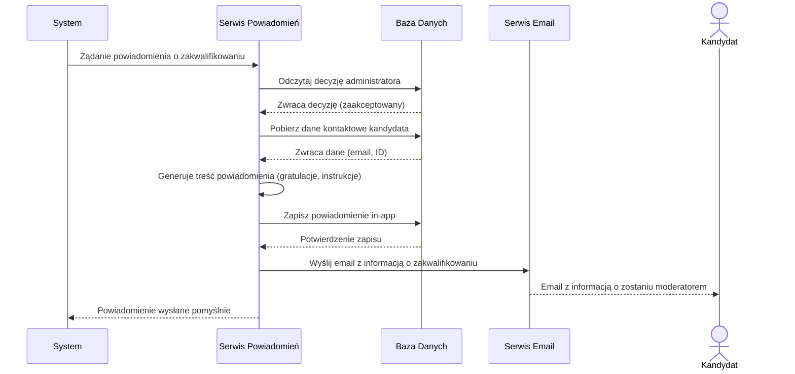

```mermaid
sequenceDiagram
    participant S as System
    participant NS as Serwis Powiadomień
    participant DB as Baza Danych
    participant E as Serwis Email
    actor K as Kandydat

    S->>NS: Żądanie powiadomienia o zakwalifikowaniu
    NS->>DB: Odczytaj decyzję administratora
    DB-->>NS: Zwraca decyzję (zaakceptowany)
    NS->>DB: Pobierz dane kontaktowe kandydata
    DB-->>NS: Zwraca dane (email, ID)

    NS->>NS: Generuje treść powiadomienia (gratulacje, instrukcje)
    NS->>DB: Zapisz powiadomienie in-app
    DB-->>NS: Potwierdzenie zapisu
    NS->>E: Wyślij email z informacją o zakwalifikowaniu
    E-->>K: Email z informacją o zostaniu moderatorem

    NS-->>S: Powiadomienie wysłane pomyślnie
```
