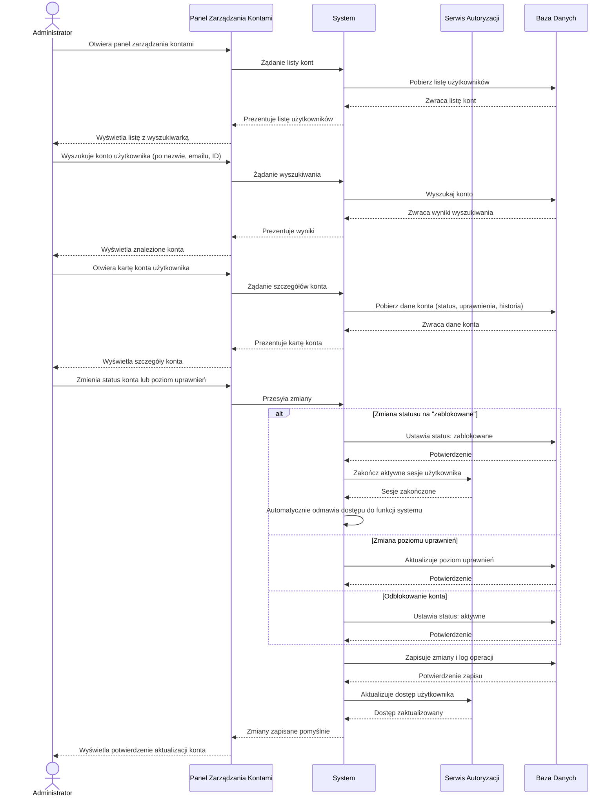

```mermaid
sequenceDiagram
    actor A as Administrator
    participant UI as Panel Zarządzania Kontami
    participant S as System
    participant Auth as Serwis Autoryzacji
    participant DB as Baza Danych

    A->>UI: Otwiera panel zarządzania kontami
    UI->>S: Żądanie listy kont
    S->>DB: Pobierz listę użytkowników
    DB-->>S: Zwraca listę kont
    S-->>UI: Prezentuje listę użytkowników
    UI-->>A: Wyświetla listę z wyszukiwarką

    A->>UI: Wyszukuje konto użytkownika (po nazwie, emailu, ID)
    UI->>S: Żądanie wyszukiwania
    S->>DB: Wyszukaj konto
    DB-->>S: Zwraca wyniki wyszukiwania
    S-->>UI: Prezentuje wyniki
    UI-->>A: Wyświetla znalezione konta

    A->>UI: Otwiera kartę konta użytkownika
    UI->>S: Żądanie szczegółów konta
    S->>DB: Pobierz dane konta (status, uprawnienia, historia)
    DB-->>S: Zwraca dane konta
    S-->>UI: Prezentuje kartę konta
    UI-->>A: Wyświetla szczegóły konta

    A->>UI: Zmienia status konta lub poziom uprawnień
    UI->>S: Przesyła zmiany

    alt Zmiana statusu na "zablokowane"
        S->>DB: Ustawia status: zablokowane
        DB-->>S: Potwierdzenie
        S->>Auth: Zakończ aktywne sesje użytkownika
        Auth-->>S: Sesje zakończone
        S->>S: Automatycznie odmawia dostępu do funkcji systemu
    else Zmiana poziomu uprawnień
        S->>DB: Aktualizuje poziom uprawnień
        DB-->>S: Potwierdzenie
    else Odblokowanie konta
        S->>DB: Ustawia status: aktywne
        DB-->>S: Potwierdzenie
    end

    S->>DB: Zapisuje zmiany i log operacji
    DB-->>S: Potwierdzenie zapisu
    S->>Auth: Aktualizuje dostęp użytkownika
    Auth-->>S: Dostęp zaktualizowany

    S-->>UI: Zmiany zapisane pomyślnie
    UI-->>A: Wyświetla potwierdzenie aktualizacji konta
```
