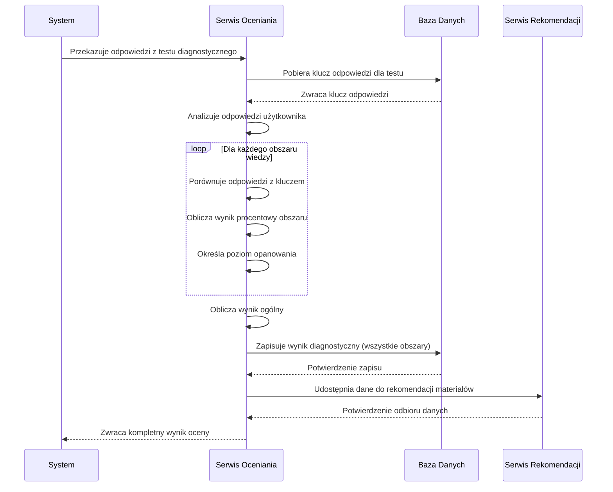

```mermaid
sequenceDiagram
    participant S as System
    participant AS as Serwis Oceniania
    participant DB as Baza Danych
    participant RS as Serwis Rekomendacji

    S->>AS: Przekazuje odpowiedzi z testu diagnostycznego
    AS->>DB: Pobiera klucz odpowiedzi dla testu
    DB-->>AS: Zwraca klucz odpowiedzi

    AS->>AS: Analizuje odpowiedzi użytkownika

    loop Dla każdego obszaru wiedzy
        AS->>AS: Porównuje odpowiedzi z kluczem
        AS->>AS: Oblicza wynik procentowy obszaru
        AS->>AS: Określa poziom opanowania
    end

    AS->>AS: Oblicza wynik ogólny
    AS->>DB: Zapisuje wynik diagnostyczny (wszystkie obszary)
    DB-->>AS: Potwierdzenie zapisu

    AS->>RS: Udostępnia dane do rekomendacji materiałów
    RS-->>AS: Potwierdzenie odbioru danych

    AS-->>S: Zwraca kompletny wynik oceny
```
