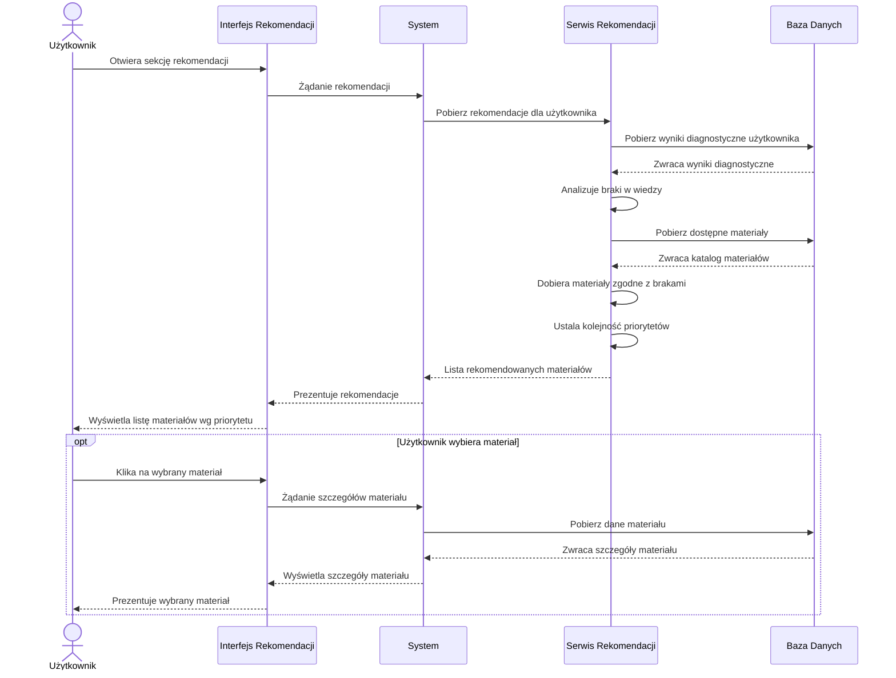

```mermaid
sequenceDiagram
    actor U as Użytkownik
    participant UI as Interfejs Rekomendacji
    participant S as System
    participant RS as Serwis Rekomendacji
    participant DB as Baza Danych

    U->>UI: Otwiera sekcję rekomendacji
    UI->>S: Żądanie rekomendacji
    S->>RS: Pobierz rekomendacje dla użytkownika
    RS->>DB: Pobierz wyniki diagnostyczne użytkownika
    DB-->>RS: Zwraca wyniki diagnostyczne

    RS->>RS: Analizuje braki w wiedzy
    RS->>DB: Pobierz dostępne materiały
    DB-->>RS: Zwraca katalog materiałów

    RS->>RS: Dobiera materiały zgodne z brakami
    RS->>RS: Ustala kolejność priorytetów
    RS-->>S: Lista rekomendowanych materiałów

    S-->>UI: Prezentuje rekomendacje
    UI-->>U: Wyświetla listę materiałów wg priorytetu

    opt Użytkownik wybiera materiał
        U->>UI: Klika na wybrany materiał
        UI->>S: Żądanie szczegółów materiału
        S->>DB: Pobierz dane materiału
        DB-->>S: Zwraca szczegóły materiału
        S-->>UI: Wyświetla szczegóły materiału
        UI-->>U: Prezentuje wybrany materiał
    end
```
