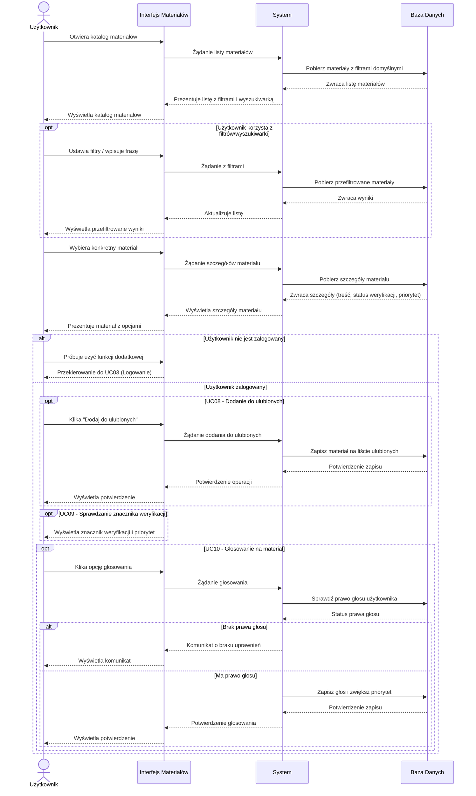

```mermaid
sequenceDiagram
    actor U as Użytkownik
    participant UI as Interfejs Materiałów
    participant S as System
    participant DB as Baza Danych

    U->>UI: Otwiera katalog materiałów
    UI->>S: Żądanie listy materiałów
    S->>DB: Pobierz materiały z filtrami domyślnymi
    DB-->>S: Zwraca listę materiałów
    S-->>UI: Prezentuje listę z filtrami i wyszukiwarką
    UI-->>U: Wyświetla katalog materiałów

    opt Użytkownik korzysta z filtrów/wyszukiwarki
        U->>UI: Ustawia filtry / wpisuje frazę
        UI->>S: Żądanie z filtrami
        S->>DB: Pobierz przefiltrowane materiały
        DB-->>S: Zwraca wyniki
        S-->>UI: Aktualizuje listę
        UI-->>U: Wyświetla przefiltrowane wyniki
    end

    U->>UI: Wybiera konkretny materiał
    UI->>S: Żądanie szczegółów materiału
    S->>DB: Pobierz szczegóły materiału
    DB-->>S: Zwraca szczegóły (treść, status weryfikacji, priorytet)
    S-->>UI: Wyświetla szczegóły materiału
    UI-->>U: Prezentuje materiał z opcjami

    alt Użytkownik nie jest zalogowany
        U->>UI: Próbuje użyć funkcji dodatkowej
        UI-->>U: Przekierowanie do UC03 (Logowanie)
    else Użytkownik zalogowany
        opt UC08 - Dodanie do ulubionych
            U->>UI: Klika "Dodaj do ulubionych"
            UI->>S: Żądanie dodania do ulubionych
            S->>DB: Zapisz materiał na liście ulubionych
            DB-->>S: Potwierdzenie zapisu
            S-->>UI: Potwierdzenie operacji
            UI-->>U: Wyświetla potwierdzenie
        end

        opt UC09 - Sprawdzanie znacznika weryfikacji
            UI-->>U: Wyświetla znacznik weryfikacji i priorytet
        end

        opt UC10 - Głosowanie na materiał
            U->>UI: Klika opcję głosowania
            UI->>S: Żądanie głosowania
            S->>DB: Sprawdź prawo głosu użytkownika
            DB-->>S: Status prawa głosu
            alt Brak prawa głosu
                S-->>UI: Komunikat o braku uprawnień
                UI-->>U: Wyświetla komunikat
            else Ma prawo głosu
                S->>DB: Zapisz głos i zwiększ priorytet
                DB-->>S: Potwierdzenie zapisu
                S-->>UI: Potwierdzenie głosowania
                UI-->>U: Wyświetla potwierdzenie
            end
        end
    end
```
