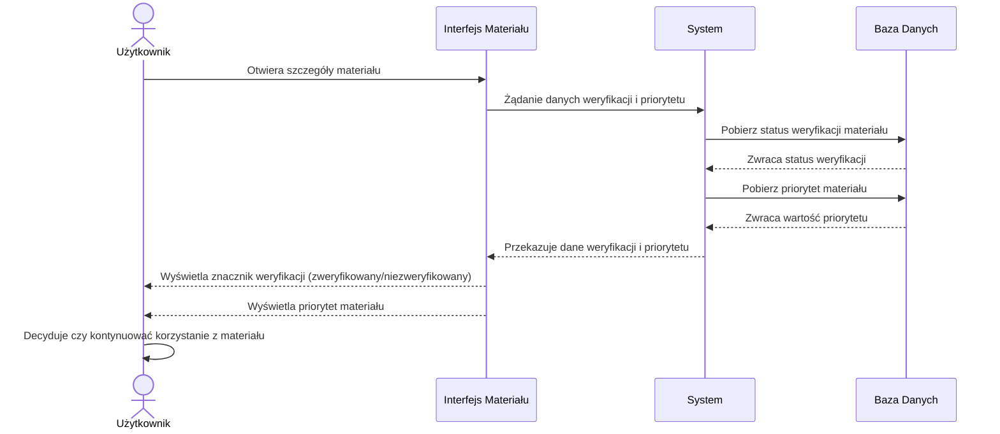

```mermaid
sequenceDiagram
    actor U as Użytkownik
    participant UI as Interfejs Materiału
    participant S as System
    participant DB as Baza Danych

    U->>UI: Otwiera szczegóły materiału
    UI->>S: Żądanie danych weryfikacji i priorytetu
    S->>DB: Pobierz status weryfikacji materiału
    DB-->>S: Zwraca status weryfikacji
    S->>DB: Pobierz priorytet materiału
    DB-->>S: Zwraca wartość priorytetu

    S-->>UI: Przekazuje dane weryfikacji i priorytetu
    UI-->>U: Wyświetla znacznik weryfikacji (zweryfikowany/niezweryfikowany)
    UI-->>U: Wyświetla priorytet materiału

    U->>U: Decyduje czy kontynuować korzystanie z materiału
```
